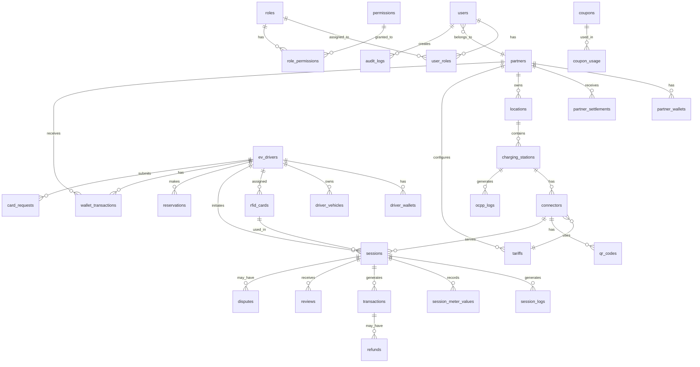

# Database Design Document
# EV Charging Management Platform

**Version:** 1.0
**Date:** June 2026

---

## Table of Contents
1. [Overview](#1-overview)
2. [Entity Relationship Diagram](#2-entity-relationship-diagram)
3. [Table Definitions](#3-table-definitions)
4. [Indexing Strategy](#4-indexing-strategy)
5. [Relationships & Constraints](#5-relationships--constraints)
6. [Partitioning Strategy](#6-partitioning-strategy)
7. [Data Types & Standards](#7-data-types--standards)

---

## 1. Overview

### 1.1 Database System
- **Database**: PostgreSQL 15+
- **Character Set**: UTF-8
- **Collation**: en_US.UTF-8
- **Extensions**: uuid-ossp, pg_trgm

### 1.2 Design Principles
- UUID primary keys for distributed systems compatibility
- Soft deletes on critical tables (deleted_at column)
- Audit timestamps (created_at, updated_at)
- Foreign key constraints for referential integrity
- Proper indexing for query performance
- Partitioning for high-volume tables

### 1.3 Table Categories
| Category | Tables | Description |
|----------|--------|-------------|
| Auth & Users | 5 | Authentication and authorization |
| Partners | 2 | Partner organizations |
| Infrastructure | 3 | Locations, stations, connectors |
| Drivers | 4 | EV drivers and vehicles |
| Operations | 4 | Sessions, reservations, meter values |
| Finance | 4 | Transactions, wallets, settlements |
| Support | 6 | Cards, reviews, disputes, coupons |
| System | 5 | Logs, notifications, QR codes |

---

## 2. Entity Relationship Diagram



---

## 3. Table Definitions

### 3.1 Authentication & Authorization

#### users
```sql
CREATE TABLE users (
    id              UUID PRIMARY KEY DEFAULT uuid_generate_v4(),
    partner_id      UUID REFERENCES partners(id) ON DELETE SET NULL,
    email           VARCHAR(255) NOT NULL UNIQUE,
    password_hash   VARCHAR(255) NOT NULL,
    first_name      VARCHAR(100) NOT NULL,
    last_name       VARCHAR(100) NOT NULL,
    phone           VARCHAR(20),
    avatar_url      VARCHAR(500),
    status          VARCHAR(20) NOT NULL DEFAULT 'active'
                    CHECK (status IN ('active', 'inactive', 'suspended')),
    email_verified  BOOLEAN DEFAULT FALSE,
    last_login_at   TIMESTAMP WITH TIME ZONE,
    failed_attempts INTEGER DEFAULT 0,
    locked_until    TIMESTAMP WITH TIME ZONE,
    created_at      TIMESTAMP WITH TIME ZONE DEFAULT CURRENT_TIMESTAMP,
    updated_at      TIMESTAMP WITH TIME ZONE DEFAULT CURRENT_TIMESTAMP,
    deleted_at      TIMESTAMP WITH TIME ZONE
);
```

#### roles
```sql
CREATE TABLE roles (
    id              UUID PRIMARY KEY DEFAULT uuid_generate_v4(),
    name            VARCHAR(50) NOT NULL UNIQUE,
    display_name    VARCHAR(100) NOT NULL,
    description     TEXT,
    is_system       BOOLEAN DEFAULT FALSE,
    created_at      TIMESTAMP WITH TIME ZONE DEFAULT CURRENT_TIMESTAMP,
    updated_at      TIMESTAMP WITH TIME ZONE DEFAULT CURRENT_TIMESTAMP
);
```

#### permissions
```sql
CREATE TABLE permissions (
    id              UUID PRIMARY KEY DEFAULT uuid_generate_v4(),
    name            VARCHAR(100) NOT NULL UNIQUE,
    display_name    VARCHAR(150) NOT NULL,
    module          VARCHAR(50) NOT NULL,
    description     TEXT,
    created_at      TIMESTAMP WITH TIME ZONE DEFAULT CURRENT_TIMESTAMP
);
```

#### role_permissions
```sql
CREATE TABLE role_permissions (
    role_id         UUID REFERENCES roles(id) ON DELETE CASCADE,
    permission_id   UUID REFERENCES permissions(id) ON DELETE CASCADE,
    created_at      TIMESTAMP WITH TIME ZONE DEFAULT CURRENT_TIMESTAMP,
    PRIMARY KEY (role_id, permission_id)
);
```

#### user_roles
```sql
CREATE TABLE user_roles (
    user_id         UUID REFERENCES users(id) ON DELETE CASCADE,
    role_id         UUID REFERENCES roles(id) ON DELETE CASCADE,
    created_at      TIMESTAMP WITH TIME ZONE DEFAULT CURRENT_TIMESTAMP,
    PRIMARY KEY (user_id, role_id)
);
```

### 3.2 Partners

#### partners
```sql
CREATE TABLE partners (
    id              UUID PRIMARY KEY DEFAULT uuid_generate_v4(),
    name            VARCHAR(200) NOT NULL,
    legal_name      VARCHAR(200),
    email           VARCHAR(255) NOT NULL UNIQUE,
    phone           VARCHAR(20) NOT NULL,
    address         TEXT NOT NULL,
    city            VARCHAR(100),
    state           VARCHAR(100),
    pincode         VARCHAR(10),
    gst_number      VARCHAR(20),
    pan_number      VARCHAR(20),
    commission_rate DECIMAL(5,2) NOT NULL DEFAULT 10.00,
    status          VARCHAR(20) NOT NULL DEFAULT 'active'
                    CHECK (status IN ('active', 'inactive', 'suspended')),
    logo_url        VARCHAR(500),
    settings        JSONB DEFAULT '{}',
    created_at      TIMESTAMP WITH TIME ZONE DEFAULT CURRENT_TIMESTAMP,
    updated_at      TIMESTAMP WITH TIME ZONE DEFAULT CURRENT_TIMESTAMP,
    deleted_at      TIMESTAMP WITH TIME ZONE
);
```

#### partner_wallets
```sql
CREATE TABLE partner_wallets (
    id              UUID PRIMARY KEY DEFAULT uuid_generate_v4(),
    partner_id      UUID NOT NULL REFERENCES partners(id) ON DELETE CASCADE,
    balance         DECIMAL(12,2) NOT NULL DEFAULT 0.00,
    pending_balance DECIMAL(12,2) NOT NULL DEFAULT 0.00,
    total_earned    DECIMAL(12,2) NOT NULL DEFAULT 0.00,
    total_settled   DECIMAL(12,2) NOT NULL DEFAULT 0.00,
    currency        VARCHAR(3) NOT NULL DEFAULT 'INR',
    created_at      TIMESTAMP WITH TIME ZONE DEFAULT CURRENT_TIMESTAMP,
    updated_at      TIMESTAMP WITH TIME ZONE DEFAULT CURRENT_TIMESTAMP,
    UNIQUE (partner_id)
);
```

#### partner_settlements
```sql
CREATE TABLE partner_settlements (
    id              UUID PRIMARY KEY DEFAULT uuid_generate_v4(),
    partner_id      UUID NOT NULL REFERENCES partners(id),
    amount          DECIMAL(12,2) NOT NULL,
    commission      DECIMAL(12,2) NOT NULL,
    net_amount      DECIMAL(12,2) NOT NULL,
    status          VARCHAR(20) NOT NULL DEFAULT 'pending'
                    CHECK (status IN ('pending', 'processing', 'completed', 'failed')),
    payment_ref     VARCHAR(100),
    bank_details    JSONB,
    period_start    DATE NOT NULL,
    period_end      DATE NOT NULL,
    processed_at    TIMESTAMP WITH TIME ZONE,
    processed_by    UUID REFERENCES users(id),
    notes           TEXT,
    created_at      TIMESTAMP WITH TIME ZONE DEFAULT CURRENT_TIMESTAMP,
    updated_at      TIMESTAMP WITH TIME ZONE DEFAULT CURRENT_TIMESTAMP
);
```

### 3.3 Infrastructure

#### locations
```sql
CREATE TABLE locations (
    id              UUID PRIMARY KEY DEFAULT uuid_generate_v4(),
    partner_id      UUID NOT NULL REFERENCES partners(id) ON DELETE CASCADE,
    name            VARCHAR(200) NOT NULL,
    address         TEXT NOT NULL,
    city            VARCHAR(100) NOT NULL,
    state           VARCHAR(100) NOT NULL,
    pincode         VARCHAR(10) NOT NULL,
    country         VARCHAR(50) NOT NULL DEFAULT 'India',
    latitude        DECIMAL(10,8) NOT NULL,
    longitude       DECIMAL(11,8) NOT NULL,
    operating_hours JSONB DEFAULT '{"monday":{"open":"06:00","close":"22:00"},"tuesday":{"open":"06:00","close":"22:00"},"wednesday":{"open":"06:00","close":"22:00"},"thursday":{"open":"06:00","close":"22:00"},"friday":{"open":"06:00","close":"22:00"},"saturday":{"open":"06:00","close":"22:00"},"sunday":{"open":"06:00","close":"22:00"}}',
    amenities       TEXT[] DEFAULT '{}',
    images          TEXT[] DEFAULT '{}',
    contact_phone   VARCHAR(20),
    contact_email   VARCHAR(255),
    directions      TEXT,
    status          VARCHAR(20) NOT NULL DEFAULT 'active'
                    CHECK (status IN ('active', 'inactive', 'coming_soon')),
    created_at      TIMESTAMP WITH TIME ZONE DEFAULT CURRENT_TIMESTAMP,
    updated_at      TIMESTAMP WITH TIME ZONE DEFAULT CURRENT_TIMESTAMP,
    deleted_at      TIMESTAMP WITH TIME ZONE
);
```

#### charging_stations
```sql
CREATE TABLE charging_stations (
    id                  UUID PRIMARY KEY DEFAULT uuid_generate_v4(),
    location_id         UUID NOT NULL REFERENCES locations(id) ON DELETE CASCADE,
    ocpp_identity       VARCHAR(50) NOT NULL UNIQUE,
    name                VARCHAR(100),
    vendor              VARCHAR(100),
    model               VARCHAR(100),
    serial_number       VARCHAR(100),
    firmware_version    VARCHAR(50),
    iccid               VARCHAR(30),
    imsi                VARCHAR(30),
    is_online           BOOLEAN DEFAULT FALSE,
    last_heartbeat      TIMESTAMP WITH TIME ZONE,
    last_boot           TIMESTAMP WITH TIME ZONE,
    boot_notification   JSONB,
    configuration       JSONB DEFAULT '{}',
    status              VARCHAR(20) NOT NULL DEFAULT 'active'
                        CHECK (status IN ('active', 'inactive', 'maintenance')),
    error_code          VARCHAR(50),
    error_info          TEXT,
    created_at          TIMESTAMP WITH TIME ZONE DEFAULT CURRENT_TIMESTAMP,
    updated_at          TIMESTAMP WITH TIME ZONE DEFAULT CURRENT_TIMESTAMP,
    deleted_at          TIMESTAMP WITH TIME ZONE
);
```

#### connectors
```sql
CREATE TABLE connectors (
    id                  UUID PRIMARY KEY DEFAULT uuid_generate_v4(),
    station_id          UUID NOT NULL REFERENCES charging_stations(id) ON DELETE CASCADE,
    tariff_id           UUID REFERENCES tariffs(id) ON DELETE SET NULL,
    connector_id        INTEGER NOT NULL,
    connector_type      VARCHAR(20) NOT NULL
                        CHECK (connector_type IN ('CCS1', 'CCS2', 'CHAdeMO', 'Type1', 'Type2', 'GBT')),
    power_kw            DECIMAL(6,2) NOT NULL,
    voltage             INTEGER,
    amperage            INTEGER,
    ocpp_status         VARCHAR(30) NOT NULL DEFAULT 'Unavailable'
                        CHECK (ocpp_status IN ('Available', 'Preparing', 'Charging', 'SuspendedEVSE', 'SuspendedEV', 'Finishing', 'Reserved', 'Unavailable', 'Faulted')),
    status              VARCHAR(20) NOT NULL DEFAULT 'active'
                        CHECK (status IN ('active', 'inactive', 'maintenance')),
    last_status_update  TIMESTAMP WITH TIME ZONE,
    error_code          VARCHAR(50),
    created_at          TIMESTAMP WITH TIME ZONE DEFAULT CURRENT_TIMESTAMP,
    updated_at          TIMESTAMP WITH TIME ZONE DEFAULT CURRENT_TIMESTAMP,
    UNIQUE (station_id, connector_id)
);
```

### 3.4 EV Drivers

#### ev_drivers
```sql
CREATE TABLE ev_drivers (
    id              UUID PRIMARY KEY DEFAULT uuid_generate_v4(),
    phone           VARCHAR(20) NOT NULL UNIQUE,
    email           VARCHAR(255) UNIQUE,
    first_name      VARCHAR(100) NOT NULL,
    last_name       VARCHAR(100),
    avatar_url      VARCHAR(500),
    date_of_birth   DATE,
    gender          VARCHAR(10),
    status          VARCHAR(20) NOT NULL DEFAULT 'active'
                    CHECK (status IN ('active', 'inactive', 'suspended')),
    phone_verified  BOOLEAN DEFAULT TRUE,
    email_verified  BOOLEAN DEFAULT FALSE,
    last_login_at   TIMESTAMP WITH TIME ZONE,
    notification_preferences JSONB DEFAULT '{"sms":true,"email":true,"push":true}',
    created_at      TIMESTAMP WITH TIME ZONE DEFAULT CURRENT_TIMESTAMP,
    updated_at      TIMESTAMP WITH TIME ZONE DEFAULT CURRENT_TIMESTAMP,
    deleted_at      TIMESTAMP WITH TIME ZONE
);
```

#### driver_wallets
```sql
CREATE TABLE driver_wallets (
    id              UUID PRIMARY KEY DEFAULT uuid_generate_v4(),
    driver_id       UUID NOT NULL REFERENCES ev_drivers(id) ON DELETE CASCADE,
    balance         DECIMAL(10,2) NOT NULL DEFAULT 0.00,
    currency        VARCHAR(3) NOT NULL DEFAULT 'INR',
    low_balance_alert DECIMAL(10,2) DEFAULT 100.00,
    auto_topup      BOOLEAN DEFAULT FALSE,
    auto_topup_amount DECIMAL(10,2) DEFAULT 500.00,
    created_at      TIMESTAMP WITH TIME ZONE DEFAULT CURRENT_TIMESTAMP,
    updated_at      TIMESTAMP WITH TIME ZONE DEFAULT CURRENT_TIMESTAMP,
    UNIQUE (driver_id)
);
```

#### driver_vehicles
```sql
CREATE TABLE driver_vehicles (
    id                  UUID PRIMARY KEY DEFAULT uuid_generate_v4(),
    driver_id           UUID NOT NULL REFERENCES ev_drivers(id) ON DELETE CASCADE,
    make                VARCHAR(100) NOT NULL,
    model               VARCHAR(100) NOT NULL,
    year                INTEGER,
    registration_number VARCHAR(20),
    color               VARCHAR(50),
    battery_capacity_kwh DECIMAL(6,2),
    preferred_connector VARCHAR(20),
    is_primary          BOOLEAN DEFAULT FALSE,
    created_at          TIMESTAMP WITH TIME ZONE DEFAULT CURRENT_TIMESTAMP,
    updated_at          TIMESTAMP WITH TIME ZONE DEFAULT CURRENT_TIMESTAMP,
    deleted_at          TIMESTAMP WITH TIME ZONE
);
```

#### rfid_cards
```sql
CREATE TABLE rfid_cards (
    id              UUID PRIMARY KEY DEFAULT uuid_generate_v4(),
    driver_id       UUID REFERENCES ev_drivers(id) ON DELETE SET NULL,
    card_number     VARCHAR(50) NOT NULL UNIQUE,
    uid             VARCHAR(50) NOT NULL UNIQUE,
    status          VARCHAR(20) NOT NULL DEFAULT 'pending'
                    CHECK (status IN ('pending', 'active', 'blocked', 'expired', 'lost')),
    valid_from      DATE,
    valid_until     DATE,
    assigned_at     TIMESTAMP WITH TIME ZONE,
    blocked_at      TIMESTAMP WITH TIME ZONE,
    blocked_reason  TEXT,
    created_at      TIMESTAMP WITH TIME ZONE DEFAULT CURRENT_TIMESTAMP,
    updated_at      TIMESTAMP WITH TIME ZONE DEFAULT CURRENT_TIMESTAMP
);
```

### 3.5 Operations

#### sessions
```sql
CREATE TABLE sessions (
    id                  UUID PRIMARY KEY DEFAULT uuid_generate_v4(),
    connector_id        UUID NOT NULL REFERENCES connectors(id),
    driver_id           UUID REFERENCES ev_drivers(id) ON DELETE SET NULL,
    rfid_card_id        UUID REFERENCES rfid_cards(id) ON DELETE SET NULL,
    vehicle_id          UUID REFERENCES driver_vehicles(id) ON DELETE SET NULL,
    tariff_id           UUID REFERENCES tariffs(id) ON DELETE SET NULL,
    transaction_id      INTEGER,
    id_tag              VARCHAR(50),
    start_method        VARCHAR(20) NOT NULL DEFAULT 'qr'
                        CHECK (start_method IN ('qr', 'rfid', 'remote', 'plug_and_charge')),
    start_time          TIMESTAMP WITH TIME ZONE NOT NULL,
    end_time            TIMESTAMP WITH TIME ZONE,
    start_meter_wh      INTEGER NOT NULL DEFAULT 0,
    end_meter_wh        INTEGER,
    energy_consumed_kwh DECIMAL(10,3) DEFAULT 0,
    duration_minutes    INTEGER DEFAULT 0,
    idle_minutes        INTEGER DEFAULT 0,
    energy_amount       DECIMAL(10,2) DEFAULT 0.00,
    time_amount         DECIMAL(10,2) DEFAULT 0.00,
    session_fee         DECIMAL(10,2) DEFAULT 0.00,
    idle_fee            DECIMAL(10,2) DEFAULT 0.00,
    subtotal            DECIMAL(10,2) DEFAULT 0.00,
    tax_amount          DECIMAL(10,2) DEFAULT 0.00,
    discount_amount     DECIMAL(10,2) DEFAULT 0.00,
    total_amount        DECIMAL(10,2) DEFAULT 0.00,
    currency            VARCHAR(3) NOT NULL DEFAULT 'INR',
    status              VARCHAR(20) NOT NULL DEFAULT 'pending'
                        CHECK (status IN ('pending', 'active', 'completed', 'failed', 'cancelled')),
    stop_reason         VARCHAR(50),
    error_code          VARCHAR(50),
    error_info          TEXT,
    coupon_id           UUID REFERENCES coupons(id),
    metadata            JSONB DEFAULT '{}',
    created_at          TIMESTAMP WITH TIME ZONE DEFAULT CURRENT_TIMESTAMP,
    updated_at          TIMESTAMP WITH TIME ZONE DEFAULT CURRENT_TIMESTAMP
);
```

#### session_logs
```sql
CREATE TABLE session_logs (
    id              UUID PRIMARY KEY DEFAULT uuid_generate_v4(),
    session_id      UUID NOT NULL REFERENCES sessions(id) ON DELETE CASCADE,
    event_type      VARCHAR(50) NOT NULL,
    event_data      JSONB,
    timestamp       TIMESTAMP WITH TIME ZONE DEFAULT CURRENT_TIMESTAMP
);
```

#### session_meter_values
```sql
CREATE TABLE session_meter_values (
    id              UUID PRIMARY KEY DEFAULT uuid_generate_v4(),
    session_id      UUID NOT NULL REFERENCES sessions(id) ON DELETE CASCADE,
    timestamp       TIMESTAMP WITH TIME ZONE NOT NULL,
    measurand       VARCHAR(50) NOT NULL,
    value           VARCHAR(50) NOT NULL,
    unit            VARCHAR(20),
    phase           VARCHAR(10),
    context         VARCHAR(30),
    format          VARCHAR(20),
    location        VARCHAR(20),
    created_at      TIMESTAMP WITH TIME ZONE DEFAULT CURRENT_TIMESTAMP
);
```

#### reservations
```sql
CREATE TABLE reservations (
    id              UUID PRIMARY KEY DEFAULT uuid_generate_v4(),
    connector_id    UUID NOT NULL REFERENCES connectors(id) ON DELETE CASCADE,
    driver_id       UUID NOT NULL REFERENCES ev_drivers(id) ON DELETE CASCADE,
    reservation_id  INTEGER NOT NULL,
    start_time      TIMESTAMP WITH TIME ZONE NOT NULL,
    end_time        TIMESTAMP WITH TIME ZONE NOT NULL,
    status          VARCHAR(20) NOT NULL DEFAULT 'pending'
                    CHECK (status IN ('pending', 'active', 'used', 'expired', 'cancelled')),
    id_tag          VARCHAR(50),
    parent_id_tag   VARCHAR(50),
    cancelled_at    TIMESTAMP WITH TIME ZONE,
    cancelled_reason TEXT,
    created_at      TIMESTAMP WITH TIME ZONE DEFAULT CURRENT_TIMESTAMP,
    updated_at      TIMESTAMP WITH TIME ZONE DEFAULT CURRENT_TIMESTAMP
);
```

### 3.6 Finance

#### tariffs
```sql
CREATE TABLE tariffs (
    id              UUID PRIMARY KEY DEFAULT uuid_generate_v4(),
    partner_id      UUID NOT NULL REFERENCES partners(id) ON DELETE CASCADE,
    name            VARCHAR(100) NOT NULL,
    description     TEXT,
    currency        VARCHAR(3) NOT NULL DEFAULT 'INR',
    energy_rate     DECIMAL(8,4),
    time_rate       DECIMAL(8,4),
    session_fee     DECIMAL(8,2),
    idle_fee_rate   DECIMAL(8,4),
    idle_grace_minutes INTEGER DEFAULT 5,
    tax_rate        DECIMAL(5,2) DEFAULT 18.00,
    min_amount      DECIMAL(10,2) DEFAULT 0.00,
    max_amount      DECIMAL(10,2),
    is_default      BOOLEAN DEFAULT FALSE,
    status          VARCHAR(20) NOT NULL DEFAULT 'active'
                    CHECK (status IN ('active', 'inactive')),
    valid_from      DATE,
    valid_until     DATE,
    time_of_use     JSONB,
    created_at      TIMESTAMP WITH TIME ZONE DEFAULT CURRENT_TIMESTAMP,
    updated_at      TIMESTAMP WITH TIME ZONE DEFAULT CURRENT_TIMESTAMP,
    deleted_at      TIMESTAMP WITH TIME ZONE
);
```

#### transactions
```sql
CREATE TABLE transactions (
    id                  UUID PRIMARY KEY DEFAULT uuid_generate_v4(),
    session_id          UUID REFERENCES sessions(id) ON DELETE SET NULL,
    driver_id           UUID REFERENCES ev_drivers(id) ON DELETE SET NULL,
    partner_id          UUID REFERENCES partners(id) ON DELETE SET NULL,
    type                VARCHAR(30) NOT NULL
                        CHECK (type IN ('session_charge', 'wallet_topup', 'refund', 'settlement', 'adjustment')),
    amount              DECIMAL(10,2) NOT NULL,
    currency            VARCHAR(3) NOT NULL DEFAULT 'INR',
    payment_method      VARCHAR(30),
    payment_gateway     VARCHAR(30),
    gateway_order_id    VARCHAR(100),
    gateway_payment_id  VARCHAR(100),
    gateway_signature   VARCHAR(255),
    status              VARCHAR(20) NOT NULL DEFAULT 'pending'
                        CHECK (status IN ('pending', 'processing', 'completed', 'failed', 'refunded')),
    failure_reason      TEXT,
    metadata            JSONB DEFAULT '{}',
    created_at          TIMESTAMP WITH TIME ZONE DEFAULT CURRENT_TIMESTAMP,
    updated_at          TIMESTAMP WITH TIME ZONE DEFAULT CURRENT_TIMESTAMP
);
```

#### wallet_transactions
```sql
CREATE TABLE wallet_transactions (
    id              UUID PRIMARY KEY DEFAULT uuid_generate_v4(),
    wallet_type     VARCHAR(20) NOT NULL CHECK (wallet_type IN ('driver', 'partner')),
    driver_id       UUID REFERENCES ev_drivers(id) ON DELETE SET NULL,
    partner_id      UUID REFERENCES partners(id) ON DELETE SET NULL,
    transaction_id  UUID REFERENCES transactions(id),
    session_id      UUID REFERENCES sessions(id),
    type            VARCHAR(30) NOT NULL
                    CHECK (type IN ('credit', 'debit')),
    category        VARCHAR(30) NOT NULL
                    CHECK (category IN ('topup', 'charge', 'refund', 'settlement', 'adjustment', 'coupon')),
    amount          DECIMAL(10,2) NOT NULL,
    balance_before  DECIMAL(10,2) NOT NULL,
    balance_after   DECIMAL(10,2) NOT NULL,
    currency        VARCHAR(3) NOT NULL DEFAULT 'INR',
    description     TEXT,
    reference       VARCHAR(100),
    created_at      TIMESTAMP WITH TIME ZONE DEFAULT CURRENT_TIMESTAMP,
    CHECK (
        (wallet_type = 'driver' AND driver_id IS NOT NULL) OR
        (wallet_type = 'partner' AND partner_id IS NOT NULL)
    )
);
```

#### refunds
```sql
CREATE TABLE refunds (
    id                  UUID PRIMARY KEY DEFAULT uuid_generate_v4(),
    transaction_id      UUID NOT NULL REFERENCES transactions(id),
    session_id          UUID REFERENCES sessions(id),
    driver_id           UUID REFERENCES ev_drivers(id),
    amount              DECIMAL(10,2) NOT NULL,
    reason              TEXT NOT NULL,
    status              VARCHAR(20) NOT NULL DEFAULT 'pending'
                        CHECK (status IN ('pending', 'processing', 'completed', 'failed')),
    gateway_refund_id   VARCHAR(100),
    processed_at        TIMESTAMP WITH TIME ZONE,
    processed_by        UUID REFERENCES users(id),
    notes               TEXT,
    created_at          TIMESTAMP WITH TIME ZONE DEFAULT CURRENT_TIMESTAMP,
    updated_at          TIMESTAMP WITH TIME ZONE DEFAULT CURRENT_TIMESTAMP
);
```

### 3.7 Support

#### coupons
```sql
CREATE TABLE coupons (
    id              UUID PRIMARY KEY DEFAULT uuid_generate_v4(),
    partner_id      UUID REFERENCES partners(id) ON DELETE CASCADE,
    code            VARCHAR(50) NOT NULL UNIQUE,
    name            VARCHAR(100) NOT NULL,
    description     TEXT,
    discount_type   VARCHAR(20) NOT NULL
                    CHECK (discount_type IN ('percentage', 'fixed')),
    discount_value  DECIMAL(10,2) NOT NULL,
    max_discount    DECIMAL(10,2),
    min_amount      DECIMAL(10,2) DEFAULT 0.00,
    usage_limit     INTEGER,
    usage_count     INTEGER DEFAULT 0,
    per_user_limit  INTEGER DEFAULT 1,
    valid_from      TIMESTAMP WITH TIME ZONE NOT NULL,
    valid_until     TIMESTAMP WITH TIME ZONE NOT NULL,
    applicable_to   VARCHAR(30) DEFAULT 'all'
                    CHECK (applicable_to IN ('all', 'new_users', 'specific_locations')),
    locations       UUID[],
    status          VARCHAR(20) NOT NULL DEFAULT 'active'
                    CHECK (status IN ('active', 'inactive', 'expired')),
    created_at      TIMESTAMP WITH TIME ZONE DEFAULT CURRENT_TIMESTAMP,
    updated_at      TIMESTAMP WITH TIME ZONE DEFAULT CURRENT_TIMESTAMP
);
```

#### coupon_usage
```sql
CREATE TABLE coupon_usage (
    id              UUID PRIMARY KEY DEFAULT uuid_generate_v4(),
    coupon_id       UUID NOT NULL REFERENCES coupons(id) ON DELETE CASCADE,
    driver_id       UUID NOT NULL REFERENCES ev_drivers(id) ON DELETE CASCADE,
    session_id      UUID REFERENCES sessions(id),
    discount_amount DECIMAL(10,2) NOT NULL,
    used_at         TIMESTAMP WITH TIME ZONE DEFAULT CURRENT_TIMESTAMP
);
```

#### reviews
```sql
CREATE TABLE reviews (
    id              UUID PRIMARY KEY DEFAULT uuid_generate_v4(),
    session_id      UUID NOT NULL REFERENCES sessions(id) ON DELETE CASCADE,
    driver_id       UUID NOT NULL REFERENCES ev_drivers(id) ON DELETE CASCADE,
    location_id     UUID NOT NULL REFERENCES locations(id) ON DELETE CASCADE,
    station_id      UUID REFERENCES charging_stations(id) ON DELETE SET NULL,
    rating          INTEGER NOT NULL CHECK (rating >= 1 AND rating <= 5),
    comment         TEXT,
    response        TEXT,
    responded_at    TIMESTAMP WITH TIME ZONE,
    responded_by    UUID REFERENCES users(id),
    is_visible      BOOLEAN DEFAULT TRUE,
    created_at      TIMESTAMP WITH TIME ZONE DEFAULT CURRENT_TIMESTAMP,
    updated_at      TIMESTAMP WITH TIME ZONE DEFAULT CURRENT_TIMESTAMP
);
```

#### disputes
```sql
CREATE TABLE disputes (
    id              UUID PRIMARY KEY DEFAULT uuid_generate_v4(),
    session_id      UUID REFERENCES sessions(id),
    transaction_id  UUID REFERENCES transactions(id),
    driver_id       UUID NOT NULL REFERENCES ev_drivers(id),
    partner_id      UUID NOT NULL REFERENCES partners(id),
    category        VARCHAR(50) NOT NULL
                    CHECK (category IN ('incorrect_billing', 'session_not_started', 'payment_issue', 'station_malfunction', 'other')),
    subject         VARCHAR(200) NOT NULL,
    description     TEXT NOT NULL,
    status          VARCHAR(20) NOT NULL DEFAULT 'open'
                    CHECK (status IN ('open', 'in_progress', 'resolved', 'closed', 'escalated')),
    priority        VARCHAR(20) DEFAULT 'medium'
                    CHECK (priority IN ('low', 'medium', 'high', 'critical')),
    resolution      TEXT,
    refund_amount   DECIMAL(10,2),
    assigned_to     UUID REFERENCES users(id),
    resolved_at     TIMESTAMP WITH TIME ZONE,
    resolved_by     UUID REFERENCES users(id),
    attachments     TEXT[],
    created_at      TIMESTAMP WITH TIME ZONE DEFAULT CURRENT_TIMESTAMP,
    updated_at      TIMESTAMP WITH TIME ZONE DEFAULT CURRENT_TIMESTAMP
);
```

#### card_requests
```sql
CREATE TABLE card_requests (
    id              UUID PRIMARY KEY DEFAULT uuid_generate_v4(),
    driver_id       UUID NOT NULL REFERENCES ev_drivers(id) ON DELETE CASCADE,
    request_type    VARCHAR(20) NOT NULL
                    CHECK (request_type IN ('new', 'replacement', 'additional')),
    status          VARCHAR(20) NOT NULL DEFAULT 'pending'
                    CHECK (status IN ('pending', 'approved', 'rejected', 'shipped', 'delivered')),
    shipping_address JSONB NOT NULL,
    tracking_number VARCHAR(100),
    rfid_card_id    UUID REFERENCES rfid_cards(id),
    rejection_reason TEXT,
    processed_at    TIMESTAMP WITH TIME ZONE,
    processed_by    UUID REFERENCES users(id),
    shipped_at      TIMESTAMP WITH TIME ZONE,
    delivered_at    TIMESTAMP WITH TIME ZONE,
    created_at      TIMESTAMP WITH TIME ZONE DEFAULT CURRENT_TIMESTAMP,
    updated_at      TIMESTAMP WITH TIME ZONE DEFAULT CURRENT_TIMESTAMP
);
```

### 3.8 System

#### qr_codes
```sql
CREATE TABLE qr_codes (
    id              UUID PRIMARY KEY DEFAULT uuid_generate_v4(),
    connector_id    UUID NOT NULL REFERENCES connectors(id) ON DELETE CASCADE,
    code            VARCHAR(100) NOT NULL UNIQUE,
    payload         JSONB NOT NULL,
    image_url       VARCHAR(500),
    is_active       BOOLEAN DEFAULT TRUE,
    scans_count     INTEGER DEFAULT 0,
    last_scanned_at TIMESTAMP WITH TIME ZONE,
    created_at      TIMESTAMP WITH TIME ZONE DEFAULT CURRENT_TIMESTAMP,
    updated_at      TIMESTAMP WITH TIME ZONE DEFAULT CURRENT_TIMESTAMP,
    UNIQUE (connector_id)
);
```

#### notifications
```sql
CREATE TABLE notifications (
    id              UUID PRIMARY KEY DEFAULT uuid_generate_v4(),
    user_type       VARCHAR(20) NOT NULL CHECK (user_type IN ('user', 'driver')),
    user_id         UUID,
    driver_id       UUID,
    type            VARCHAR(50) NOT NULL,
    title           VARCHAR(200) NOT NULL,
    message         TEXT NOT NULL,
    data            JSONB,
    channel         VARCHAR(20) NOT NULL
                    CHECK (channel IN ('in_app', 'sms', 'email', 'push')),
    status          VARCHAR(20) NOT NULL DEFAULT 'pending'
                    CHECK (status IN ('pending', 'sent', 'delivered', 'failed', 'read')),
    sent_at         TIMESTAMP WITH TIME ZONE,
    read_at         TIMESTAMP WITH TIME ZONE,
    created_at      TIMESTAMP WITH TIME ZONE DEFAULT CURRENT_TIMESTAMP,
    CHECK (
        (user_type = 'user' AND user_id IS NOT NULL) OR
        (user_type = 'driver' AND driver_id IS NOT NULL)
    )
);
```

#### audit_logs
```sql
CREATE TABLE audit_logs (
    id              UUID PRIMARY KEY DEFAULT uuid_generate_v4(),
    user_id         UUID REFERENCES users(id) ON DELETE SET NULL,
    user_type       VARCHAR(20),
    action          VARCHAR(50) NOT NULL,
    resource        VARCHAR(50) NOT NULL,
    resource_id     UUID,
    old_values      JSONB,
    new_values      JSONB,
    ip_address      INET,
    user_agent      TEXT,
    request_id      VARCHAR(100),
    created_at      TIMESTAMP WITH TIME ZONE DEFAULT CURRENT_TIMESTAMP
);
```

#### ocpp_logs
```sql
CREATE TABLE ocpp_logs (
    id              UUID PRIMARY KEY DEFAULT uuid_generate_v4(),
    station_id      UUID REFERENCES charging_stations(id) ON DELETE SET NULL,
    ocpp_identity   VARCHAR(50) NOT NULL,
    direction       VARCHAR(10) NOT NULL CHECK (direction IN ('incoming', 'outgoing')),
    message_type    VARCHAR(30) NOT NULL,
    message_id      VARCHAR(50),
    action          VARCHAR(50),
    payload         JSONB,
    error_code      VARCHAR(50),
    error_description TEXT,
    created_at      TIMESTAMP WITH TIME ZONE DEFAULT CURRENT_TIMESTAMP
);
```

#### server_logs
```sql
CREATE TABLE server_logs (
    id              UUID PRIMARY KEY DEFAULT uuid_generate_v4(),
    level           VARCHAR(10) NOT NULL,
    message         TEXT NOT NULL,
    context         JSONB,
    request_id      VARCHAR(100),
    source          VARCHAR(100),
    stack_trace     TEXT,
    created_at      TIMESTAMP WITH TIME ZONE DEFAULT CURRENT_TIMESTAMP
);
```

---

## 4. Indexing Strategy

### 4.1 Primary Indexes
All tables have primary key indexes on `id` columns.

### 4.2 Foreign Key Indexes
```sql
-- Users
CREATE INDEX idx_users_partner_id ON users(partner_id) WHERE deleted_at IS NULL;
CREATE INDEX idx_users_email ON users(email) WHERE deleted_at IS NULL;
CREATE INDEX idx_users_status ON users(status) WHERE deleted_at IS NULL;

-- Partners
CREATE INDEX idx_partners_status ON partners(status) WHERE deleted_at IS NULL;

-- Locations
CREATE INDEX idx_locations_partner_id ON locations(partner_id) WHERE deleted_at IS NULL;
CREATE INDEX idx_locations_city ON locations(city) WHERE deleted_at IS NULL;
CREATE INDEX idx_locations_coordinates ON locations USING GIST (
    point(longitude, latitude)
) WHERE deleted_at IS NULL;

-- Charging Stations
CREATE INDEX idx_stations_location_id ON charging_stations(location_id) WHERE deleted_at IS NULL;
CREATE INDEX idx_stations_ocpp_identity ON charging_stations(ocpp_identity);
CREATE INDEX idx_stations_is_online ON charging_stations(is_online) WHERE deleted_at IS NULL;

-- Connectors
CREATE INDEX idx_connectors_station_id ON connectors(station_id);
CREATE INDEX idx_connectors_ocpp_status ON connectors(ocpp_status);
CREATE INDEX idx_connectors_tariff_id ON connectors(tariff_id);

-- EV Drivers
CREATE INDEX idx_ev_drivers_phone ON ev_drivers(phone) WHERE deleted_at IS NULL;
CREATE INDEX idx_ev_drivers_email ON ev_drivers(email) WHERE deleted_at IS NULL;
CREATE INDEX idx_ev_drivers_status ON ev_drivers(status) WHERE deleted_at IS NULL;

-- Sessions
CREATE INDEX idx_sessions_connector_id ON sessions(connector_id);
CREATE INDEX idx_sessions_driver_id ON sessions(driver_id);
CREATE INDEX idx_sessions_status ON sessions(status);
CREATE INDEX idx_sessions_start_time ON sessions(start_time);
CREATE INDEX idx_sessions_transaction_id ON sessions(transaction_id);

-- Transactions
CREATE INDEX idx_transactions_session_id ON transactions(session_id);
CREATE INDEX idx_transactions_driver_id ON transactions(driver_id);
CREATE INDEX idx_transactions_partner_id ON transactions(partner_id);
CREATE INDEX idx_transactions_type ON transactions(type);
CREATE INDEX idx_transactions_status ON transactions(status);
CREATE INDEX idx_transactions_created_at ON transactions(created_at);

-- RFID Cards
CREATE INDEX idx_rfid_cards_driver_id ON rfid_cards(driver_id);
CREATE INDEX idx_rfid_cards_uid ON rfid_cards(uid);
CREATE INDEX idx_rfid_cards_status ON rfid_cards(status);

-- Audit Logs
CREATE INDEX idx_audit_logs_user_id ON audit_logs(user_id);
CREATE INDEX idx_audit_logs_action ON audit_logs(action);
CREATE INDEX idx_audit_logs_resource ON audit_logs(resource);
CREATE INDEX idx_audit_logs_created_at ON audit_logs(created_at);

-- OCPP Logs
CREATE INDEX idx_ocpp_logs_station_id ON ocpp_logs(station_id);
CREATE INDEX idx_ocpp_logs_action ON ocpp_logs(action);
CREATE INDEX idx_ocpp_logs_created_at ON ocpp_logs(created_at);
```

### 4.3 Full-Text Search Indexes
```sql
-- Location search
CREATE INDEX idx_locations_search ON locations USING GIN (
    to_tsvector('english', name || ' ' || address || ' ' || city)
);

-- Audit log search
CREATE INDEX idx_audit_logs_search ON audit_logs USING GIN (
    to_tsvector('english', action || ' ' || resource)
);
```

---

## 5. Relationships & Constraints

### 5.1 Cascade Rules
| Parent Table | Child Table | On Delete |
|--------------|-------------|-----------|
| partners | users | SET NULL |
| partners | locations | CASCADE |
| partners | tariffs | CASCADE |
| locations | charging_stations | CASCADE |
| charging_stations | connectors | CASCADE |
| connectors | sessions | RESTRICT |
| ev_drivers | driver_wallets | CASCADE |
| ev_drivers | driver_vehicles | CASCADE |
| sessions | session_logs | CASCADE |
| sessions | session_meter_values | CASCADE |

### 5.2 Check Constraints
All check constraints are defined inline with table definitions above.

### 5.3 Unique Constraints
```sql
-- Already defined in table schemas
-- users.email
-- partners.email
-- charging_stations.ocpp_identity
-- ev_drivers.phone
-- rfid_cards.card_number
-- rfid_cards.uid
-- coupons.code
-- qr_codes.code
-- connectors (station_id, connector_id)
```

---

## 6. Partitioning Strategy

### 6.1 Sessions Table Partitioning
```sql
-- Partition sessions by month
CREATE TABLE sessions (
    -- columns as defined above
) PARTITION BY RANGE (start_time);

-- Create partitions
CREATE TABLE sessions_2024_01 PARTITION OF sessions
    FOR VALUES FROM ('2024-01-01') TO ('2024-02-01');
CREATE TABLE sessions_2024_02 PARTITION OF sessions
    FOR VALUES FROM ('2024-02-01') TO ('2024-03-01');
-- Continue for other months...
```

### 6.2 OCPP Logs Partitioning
```sql
-- Partition OCPP logs by month
CREATE TABLE ocpp_logs (
    -- columns as defined above
) PARTITION BY RANGE (created_at);
```

### 6.3 Audit Logs Partitioning
```sql
-- Partition audit logs by month
CREATE TABLE audit_logs (
    -- columns as defined above
) PARTITION BY RANGE (created_at);
```

---

## 7. Data Types & Standards

### 7.1 UUID Generation
```sql
-- Enable uuid-ossp extension
CREATE EXTENSION IF NOT EXISTS "uuid-ossp";

-- All primary keys use uuid_generate_v4()
DEFAULT uuid_generate_v4()
```

### 7.2 Timestamp Standards
- All timestamps are `TIMESTAMP WITH TIME ZONE`
- Default to `CURRENT_TIMESTAMP`
- Store in UTC, convert on display

### 7.3 Monetary Values
- Use `DECIMAL(10,2)` for amounts
- Use `DECIMAL(8,4)` for rates
- Always store in smallest currency unit for calculations

### 7.4 Status Enums
- Defined as VARCHAR with CHECK constraints
- Allows for easier migration and flexibility

### 7.5 JSON Data
- Use `JSONB` for all JSON storage
- Enables indexing and efficient querying

---

*End of Database Design Document*
