# Workflow Documentation
# EV Charging Management Platform

**Version:** 1.0
**Date:** June 2026

---

## Table of Contents
1. [QR Code Charging Workflow](#1-qr-code-charging-workflow)
2. [RFID Card Charging Workflow](#2-rfid-card-charging-workflow)
3. [Remote Start Workflow](#3-remote-start-workflow)
4. [Payment & Wallet Top-up Workflow](#4-payment--wallet-top-up-workflow)
5. [Session Billing Workflow](#5-session-billing-workflow)
6. [Partner Settlement Workflow](#6-partner-settlement-workflow)
7. [Station Registration Workflow](#7-station-registration-workflow)
8. [OCPP Communication Workflow](#8-ocpp-communication-workflow)
9. [RFID Card Request Workflow](#9-rfid-card-request-workflow)
10. [Dispute Resolution Workflow](#10-dispute-resolution-workflow)
11. [Reservation Workflow](#11-reservation-workflow)
12. [Report Generation Workflow](#12-report-generation-workflow)

---

## 1. QR Code Charging Workflow

### 1.1 Overview
The QR code charging flow allows EV drivers to initiate a charging session by scanning a QR code displayed on the charging connector.

### 1.2 Flow Diagram

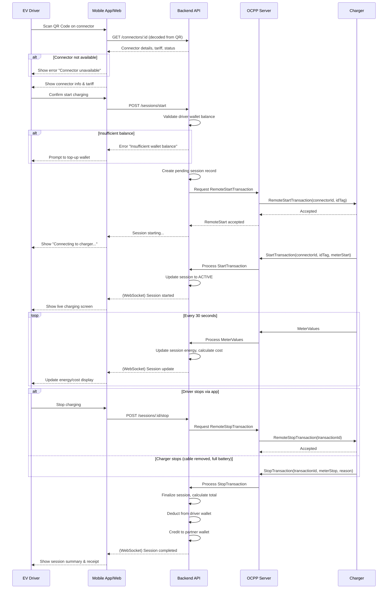
```mermaid
sequenceDiagram
    participant D as EV Driver
    participant A as Mobile App/Web
    participant B as Backend API
    participant O as OCPP Server
    participant C as Charger

    D->>A: Scan QR Code on connector
    A->>B: GET /connectors/:id (decoded from QR)
    B-->>A: Connector details, tariff, status

    alt Connector not available
        A-->>D: Show error "Connector unavailable"
    end

    A-->>D: Show connector info & tariff
    D->>A: Confirm start charging

    A->>B: POST /sessions/start
    B->>B: Validate driver wallet balance

    alt Insufficient balance
        B-->>A: Error "Insufficient wallet balance"
        A-->>D: Prompt to top-up wallet
    end

    B->>B: Create pending session record
    B->>O: Request RemoteStartTransaction
    O->>C: RemoteStartTransaction(connectorId, idTag)
    C-->>O: Accepted
    O-->>B: RemoteStart accepted
    B-->>A: Session starting...
    A-->>D: Show "Connecting to charger..."

    C->>O: StartTransaction(connectorId, idTag, meterStart)
    O->>B: Process StartTransaction
    B->>B: Update session to ACTIVE
    B-->>A: (WebSocket) Session started
    A-->>D: Show live charging screen

    loop Every 30 seconds
        C->>O: MeterValues
        O->>B: Process MeterValues
        B->>B: Update session energy, calculate cost
        B-->>A: (WebSocket) Session update
        A-->>D: Update energy/cost display
    end

    alt Driver stops via app
        D->>A: Stop charging
        A->>B: POST /sessions/:id/stop
        B->>O: Request RemoteStopTransaction
        O->>C: RemoteStopTransaction(transactionId)
        C-->>O: Accepted
    else Charger stops (cable removed, full battery)
        C->>O: StopTransaction(transactionId, meterStop, reason)
    end

    O->>B: Process StopTransaction
    B->>B: Finalize session, calculate total
    B->>B: Deduct from driver wallet
    B->>B: Credit to partner wallet
    B-->>A: (WebSocket) Session completed
    A-->>D: Show session summary & receipt
```

### 1.3 State Transitions
```
[QR Scanned] → [Connector Validated] → [Balance Verified] → [RemoteStart Sent]
                                                                    ↓
[Session Complete] ← [Charging] ← [StopTx Received] ← [StartTx Received]
```

### 1.4 Error Handling
| Error | Handling |
|-------|----------|
| QR Invalid | Show "Invalid QR code" |
| Connector Offline | Show "Station offline, try another" |
| Connector Occupied | Show "Connector in use" |
| Insufficient Balance | Redirect to wallet top-up |
| RemoteStart Rejected | Show error, suggest RFID alternative |
| Charger Fault | Create incident, notify operator |

---

## 2. RFID Card Charging Workflow

### 2.1 Overview
RFID charging allows drivers to tap their assigned card on the charger to start/stop sessions without using the app.

### 2.2 Flow Diagram

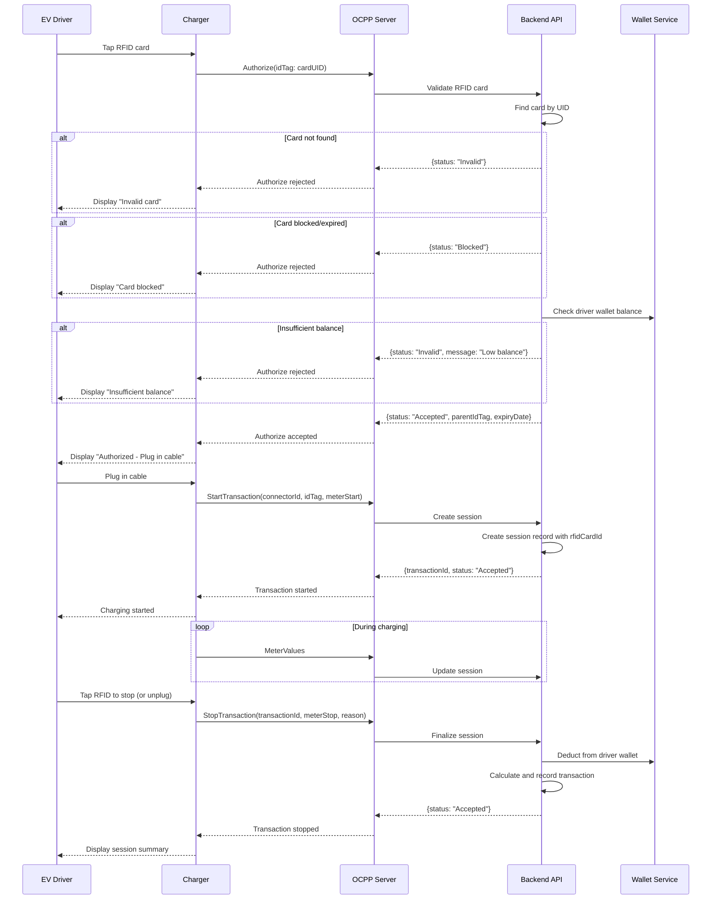
```mermaid
sequenceDiagram
    participant D as EV Driver
    participant C as Charger
    participant O as OCPP Server
    participant B as Backend API
    participant W as Wallet Service

    D->>C: Tap RFID card
    C->>O: Authorize(idTag: cardUID)
    O->>B: Validate RFID card
    B->>B: Find card by UID

    alt Card not found
        B-->>O: {status: "Invalid"}
        O-->>C: Authorize rejected
        C-->>D: Display "Invalid card"
    end

    alt Card blocked/expired
        B-->>O: {status: "Blocked"}
        O-->>C: Authorize rejected
        C-->>D: Display "Card blocked"
    end

    B->>W: Check driver wallet balance

    alt Insufficient balance
        B-->>O: {status: "Invalid", message: "Low balance"}
        O-->>C: Authorize rejected
        C-->>D: Display "Insufficient balance"
    end

    B-->>O: {status: "Accepted", parentIdTag, expiryDate}
    O-->>C: Authorize accepted
    C-->>D: Display "Authorized - Plug in cable"

    D->>C: Plug in cable
    C->>O: StartTransaction(connectorId, idTag, meterStart)
    O->>B: Create session
    B->>B: Create session record with rfidCardId
    B-->>O: {transactionId, status: "Accepted"}
    O-->>C: Transaction started
    C-->>D: Charging started

    loop During charging
        C->>O: MeterValues
        O->>B: Update session
    end

    D->>C: Tap RFID to stop (or unplug)
    C->>O: StopTransaction(transactionId, meterStop, reason)
    O->>B: Finalize session
    B->>W: Deduct from driver wallet
    B->>B: Calculate and record transaction
    B-->>O: {status: "Accepted"}
    O-->>C: Transaction stopped
    C-->>D: Display session summary
```

### 2.3 RFID Authorization Logic
```javascript
async function authorizeRfid(idTag) {
  // Find card by UID
  const card = await RfidCard.findOne({
    where: { uid: idTag },
    include: [{ model: EvDriver, as: 'driver' }]
  });

  if (!card) {
    return { status: 'Invalid' };
  }

  if (card.status === 'blocked') {
    return { status: 'Blocked' };
  }

  if (card.status === 'expired' || card.validUntil < new Date()) {
    return { status: 'Expired' };
  }

  // Check driver wallet
  const wallet = await DriverWallet.findOne({
    where: { driverId: card.driverId }
  });

  if (wallet.balance < MIN_BALANCE) {
    return { status: 'Invalid' };
  }

  return {
    status: 'Accepted',
    parentIdTag: card.cardNumber,
    expiryDate: card.validUntil
  };
}
```

---

## 3. Remote Start Workflow

### 3.1 Overview
Operators can remotely start a charging session for a driver from the admin dashboard.

### 3.2 Flow Diagram

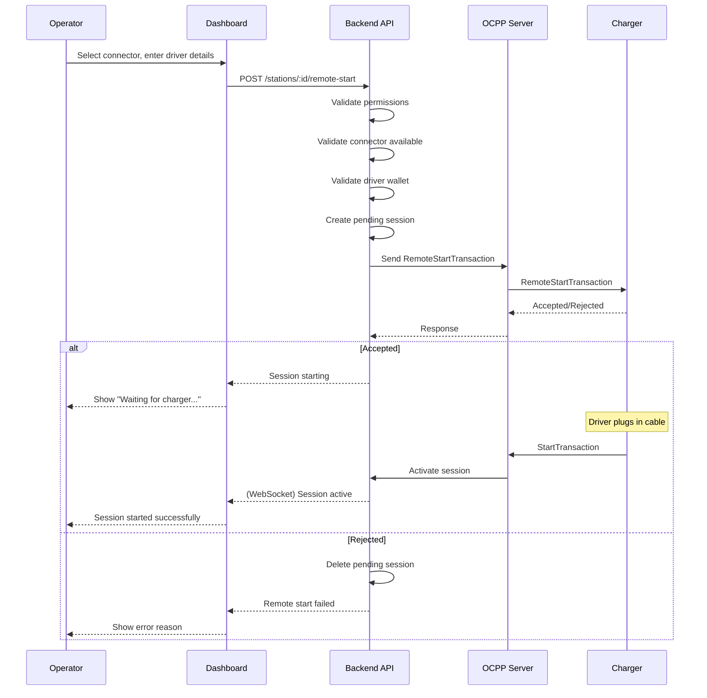
```mermaid
sequenceDiagram
    participant Op as Operator
    participant D as Dashboard
    participant B as Backend API
    participant O as OCPP Server
    participant C as Charger

    Op->>D: Select connector, enter driver details
    D->>B: POST /stations/:id/remote-start

    B->>B: Validate permissions
    B->>B: Validate connector available
    B->>B: Validate driver wallet

    B->>B: Create pending session
    B->>O: Send RemoteStartTransaction
    O->>C: RemoteStartTransaction
    C-->>O: Accepted/Rejected
    O-->>B: Response

    alt Accepted
        B-->>D: Session starting
        D-->>Op: Show "Waiting for charger..."

        Note over C: Driver plugs in cable
        C->>O: StartTransaction
        O->>B: Activate session
        B-->>D: (WebSocket) Session active
        D-->>Op: Session started successfully
    else Rejected
        B->>B: Delete pending session
        B-->>D: Remote start failed
        D-->>Op: Show error reason
    end
```

### 3.3 Remote Start Permissions
- Requires `control:stations` permission
- Partner scope enforced (can only control own stations)
- Driver must exist and have active status
- Driver wallet must have minimum balance

---

## 4. Payment & Wallet Top-up Workflow

### 4.1 Overview
Drivers can add funds to their wallet using Razorpay payment gateway.

### 4.2 Flow Diagram

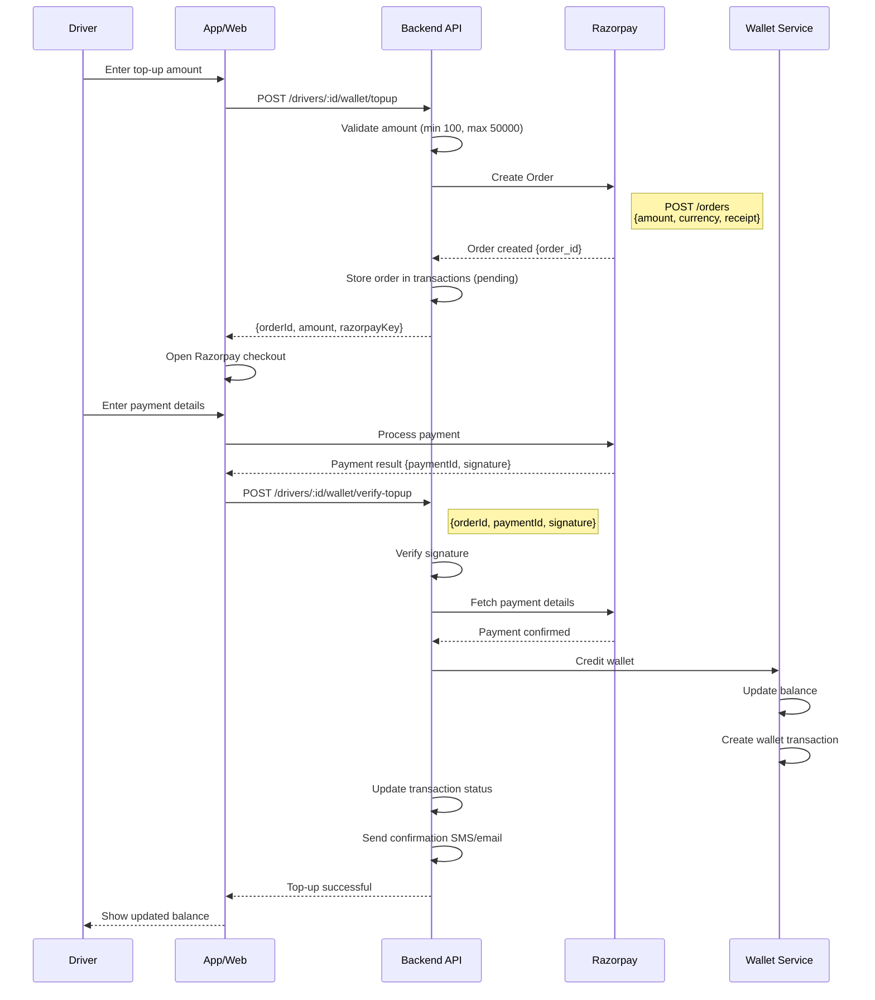
```mermaid
sequenceDiagram
    participant D as Driver
    participant A as App/Web
    participant B as Backend API
    participant R as Razorpay
    participant W as Wallet Service

    D->>A: Enter top-up amount
    A->>B: POST /drivers/:id/wallet/topup
    B->>B: Validate amount (min 100, max 50000)

    B->>R: Create Order
    Note right of R: POST /orders<br/>{amount, currency, receipt}
    R-->>B: Order created {order_id}

    B->>B: Store order in transactions (pending)
    B-->>A: {orderId, amount, razorpayKey}

    A->>A: Open Razorpay checkout
    D->>A: Enter payment details
    A->>R: Process payment
    R-->>A: Payment result {paymentId, signature}

    A->>B: POST /drivers/:id/wallet/verify-topup
    Note right of B: {orderId, paymentId, signature}

    B->>B: Verify signature
    B->>R: Fetch payment details
    R-->>B: Payment confirmed

    B->>W: Credit wallet
    W->>W: Update balance
    W->>W: Create wallet transaction

    B->>B: Update transaction status
    B->>B: Send confirmation SMS/email
    B-->>A: Top-up successful
    A-->>D: Show updated balance
```

### 4.3 Razorpay Webhook Handler
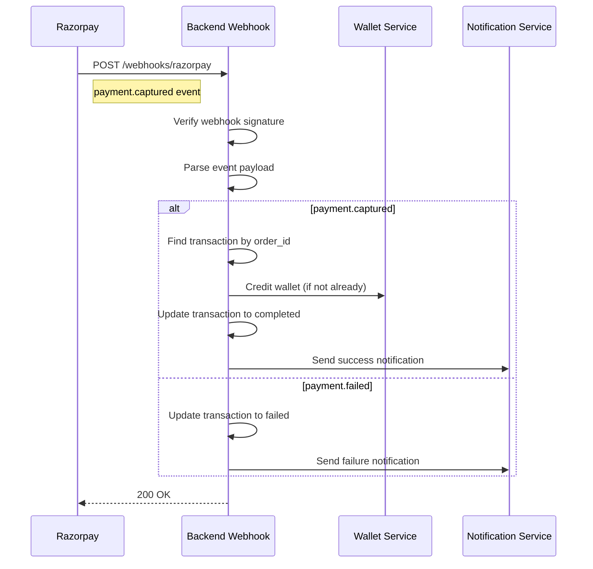
```mermaid
sequenceDiagram
    participant R as Razorpay
    participant B as Backend Webhook
    participant W as Wallet Service
    participant N as Notification Service

    R->>B: POST /webhooks/razorpay
    Note right of R: payment.captured event

    B->>B: Verify webhook signature
    B->>B: Parse event payload

    alt payment.captured
        B->>B: Find transaction by order_id
        B->>W: Credit wallet (if not already)
        B->>B: Update transaction to completed
        B->>N: Send success notification
    else payment.failed
        B->>B: Update transaction to failed
        B->>N: Send failure notification
    end

    B-->>R: 200 OK
```

---

## 5. Session Billing Workflow

### 5.1 Overview
Calculate session cost based on tariff rules when a session ends.

### 5.2 Flow Diagram

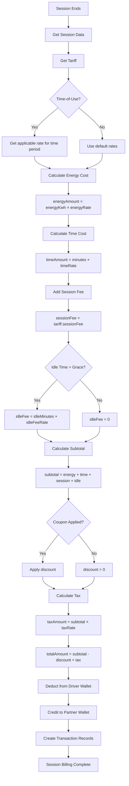
```mermaid
flowchart TD
    A[Session Ends] --> B[Get Session Data]
    B --> C[Get Tariff]
    C --> D{Time-of-Use?}

    D -->|Yes| E[Get applicable rate for time period]
    D -->|No| F[Use default rates]

    E --> G[Calculate Energy Cost]
    F --> G

    G --> H[energyAmount = energyKwh × energyRate]
    H --> I[Calculate Time Cost]
    I --> J[timeAmount = minutes × timeRate]
    J --> K[Add Session Fee]
    K --> L[sessionFee = tariff.sessionFee]

    L --> M{Idle Time > Grace?}
    M -->|Yes| N[idleFee = idleMinutes × idleFeeRate]
    M -->|No| O[idleFee = 0]

    N --> P[Calculate Subtotal]
    O --> P

    P --> Q[subtotal = energy + time + session + idle]
    Q --> R{Coupon Applied?}

    R -->|Yes| S[Apply discount]
    R -->|No| T[discount = 0]

    S --> U[Calculate Tax]
    T --> U

    U --> V[taxAmount = subtotal × taxRate]
    V --> W[totalAmount = subtotal - discount + tax]

    W --> X[Deduct from Driver Wallet]
    X --> Y[Credit to Partner Wallet]
    Y --> Z[Create Transaction Records]
    Z --> AA[Session Billing Complete]
```

### 5.3 Billing Calculation Code
```javascript
async function calculateSessionBilling(session) {
  const tariff = await Tariff.findByPk(session.tariffId);

  // Energy cost
  const energyAmount = session.energyConsumedKwh * tariff.energyRate;

  // Time cost
  const timeAmount = session.durationMinutes * tariff.timeRate;

  // Session fee
  const sessionFee = tariff.sessionFee || 0;

  // Idle fee (after charging complete)
  const idleMinutes = Math.max(0, session.idleMinutes - tariff.idleGraceMinutes);
  const idleFee = idleMinutes * tariff.idleFeeRate;

  // Subtotal
  let subtotal = energyAmount + timeAmount + sessionFee + idleFee;

  // Apply coupon discount
  let discountAmount = 0;
  if (session.couponId) {
    discountAmount = await applyCouponDiscount(session.couponId, subtotal);
  }

  // Calculate tax
  const taxableAmount = subtotal - discountAmount;
  const taxAmount = taxableAmount * (tariff.taxRate / 100);

  // Total
  const totalAmount = taxableAmount + taxAmount;

  return {
    energyAmount: round(energyAmount, 2),
    timeAmount: round(timeAmount, 2),
    sessionFee: round(sessionFee, 2),
    idleFee: round(idleFee, 2),
    subtotal: round(subtotal, 2),
    discountAmount: round(discountAmount, 2),
    taxAmount: round(taxAmount, 2),
    totalAmount: round(totalAmount, 2)
  };
}
```

---

## 6. Partner Settlement Workflow

### 6.1 Overview
Process periodic settlements to transfer accumulated revenue to partners.

### 6.2 Flow Diagram

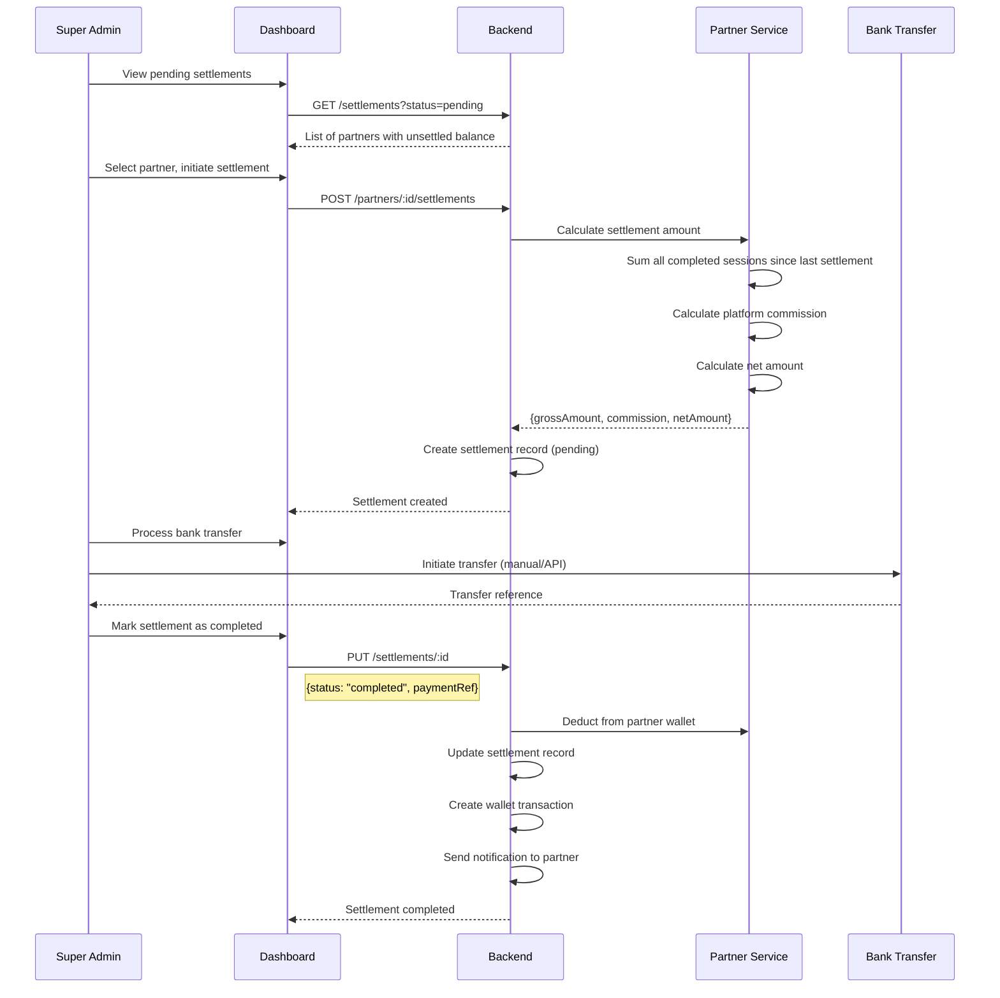
```mermaid
sequenceDiagram
    participant SA as Super Admin
    participant D as Dashboard
    participant B as Backend
    participant PS as Partner Service
    participant Bank as Bank Transfer

    SA->>D: View pending settlements
    D->>B: GET /settlements?status=pending
    B-->>D: List of partners with unsettled balance

    SA->>D: Select partner, initiate settlement
    D->>B: POST /partners/:id/settlements

    B->>PS: Calculate settlement amount
    PS->>PS: Sum all completed sessions since last settlement
    PS->>PS: Calculate platform commission
    PS->>PS: Calculate net amount
    PS-->>B: {grossAmount, commission, netAmount}

    B->>B: Create settlement record (pending)
    B-->>D: Settlement created

    SA->>D: Process bank transfer
    SA->>Bank: Initiate transfer (manual/API)
    Bank-->>SA: Transfer reference

    SA->>D: Mark settlement as completed
    D->>B: PUT /settlements/:id
    Note right of D: {status: "completed", paymentRef}

    B->>PS: Deduct from partner wallet
    B->>B: Update settlement record
    B->>B: Create wallet transaction
    B->>B: Send notification to partner
    B-->>D: Settlement completed
```

### 6.3 Settlement Calculation
```javascript
async function calculateSettlement(partnerId, periodStart, periodEnd) {
  // Get all completed sessions in period
  const sessions = await Session.findAll({
    where: {
      status: 'completed',
      endTime: { [Op.between]: [periodStart, periodEnd] }
    },
    include: [{
      model: Connector,
      include: [{
        model: ChargingStation,
        include: [{
          model: Location,
          where: { partnerId }
        }]
      }]
    }]
  });

  const grossAmount = sessions.reduce((sum, s) => sum + s.totalAmount, 0);

  const partner = await Partner.findByPk(partnerId);
  const commission = grossAmount * (partner.commissionRate / 100);
  const netAmount = grossAmount - commission;

  return {
    grossAmount,
    commission,
    netAmount,
    sessionCount: sessions.length,
    periodStart,
    periodEnd
  };
}
```

---

## 7. Station Registration Workflow

### 7.1 Overview
Register a new charging station and establish OCPP connection.

### 7.2 Flow Diagram

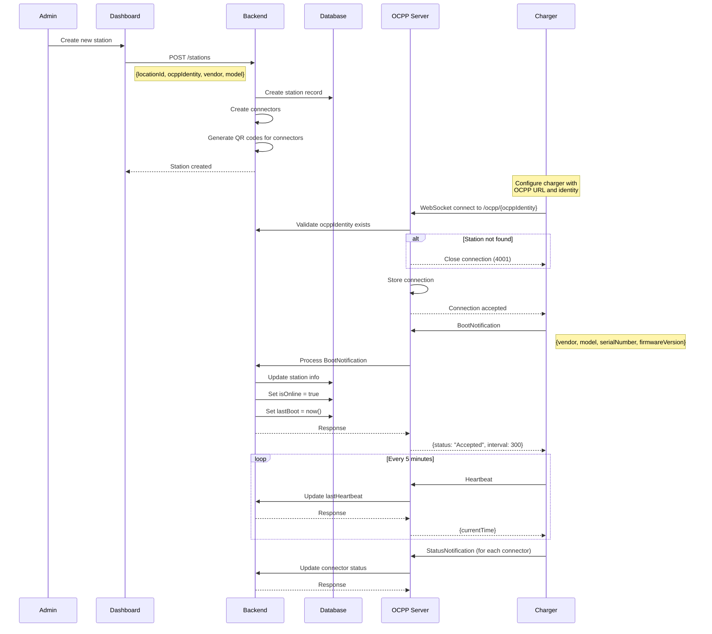
```mermaid
sequenceDiagram
    participant A as Admin
    participant D as Dashboard
    participant B as Backend
    participant DB as Database
    participant O as OCPP Server
    participant C as Charger

    A->>D: Create new station
    D->>B: POST /stations
    Note right of D: {locationId, ocppIdentity, vendor, model}

    B->>DB: Create station record
    B->>B: Create connectors
    B->>B: Generate QR codes for connectors
    B-->>D: Station created

    Note over C: Configure charger with<br/>OCPP URL and identity

    C->>O: WebSocket connect to /ocpp/{ocppIdentity}
    O->>B: Validate ocppIdentity exists

    alt Station not found
        O-->>C: Close connection (4001)
    end

    O->>O: Store connection
    O-->>C: Connection accepted

    C->>O: BootNotification
    Note right of C: {vendor, model, serialNumber, firmwareVersion}

    O->>B: Process BootNotification
    B->>DB: Update station info
    B->>DB: Set isOnline = true
    B->>DB: Set lastBoot = now()
    B-->>O: Response
    O-->>C: {status: "Accepted", interval: 300}

    loop Every 5 minutes
        C->>O: Heartbeat
        O->>B: Update lastHeartbeat
        B-->>O: Response
        O-->>C: {currentTime}
    end

    C->>O: StatusNotification (for each connector)
    O->>B: Update connector status
    B-->>O: Response
```

---

## 8. OCPP Communication Workflow

### 8.1 Overview
Complete OCPP 1.6J message flow between Central System and Charge Point.

### 8.2 Message Types

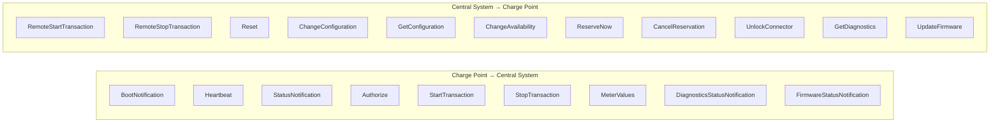
```mermaid
flowchart LR
    subgraph CP[Charge Point → Central System]
        A[BootNotification]
        B[Heartbeat]
        C[StatusNotification]
        D[Authorize]
        E[StartTransaction]
        F[StopTransaction]
        G[MeterValues]
        H[DiagnosticsStatusNotification]
        I[FirmwareStatusNotification]
    end

    subgraph CS[Central System → Charge Point]
        J[RemoteStartTransaction]
        K[RemoteStopTransaction]
        L[Reset]
        M[ChangeConfiguration]
        N[GetConfiguration]
        O[ChangeAvailability]
        P[ReserveNow]
        Q[CancelReservation]
        R[UnlockConnector]
        S[GetDiagnostics]
        T[UpdateFirmware]
    end
```

### 8.3 OCPP Message Flow

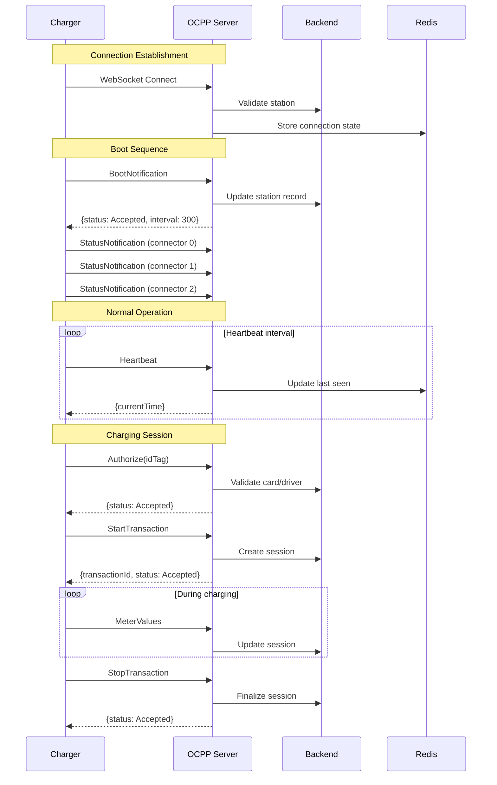
```mermaid
sequenceDiagram
    participant C as Charger
    participant O as OCPP Server
    participant B as Backend
    participant R as Redis

    Note over C,O: Connection Establishment
    C->>O: WebSocket Connect
    O->>B: Validate station
    O->>R: Store connection state

    Note over C,O: Boot Sequence
    C->>O: BootNotification
    O->>B: Update station record
    O-->>C: {status: Accepted, interval: 300}

    C->>O: StatusNotification (connector 0)
    C->>O: StatusNotification (connector 1)
    C->>O: StatusNotification (connector 2)

    Note over C,O: Normal Operation
    loop Heartbeat interval
        C->>O: Heartbeat
        O->>R: Update last seen
        O-->>C: {currentTime}
    end

    Note over C,O: Charging Session
    C->>O: Authorize(idTag)
    O->>B: Validate card/driver
    O-->>C: {status: Accepted}

    C->>O: StartTransaction
    O->>B: Create session
    O-->>C: {transactionId, status: Accepted}

    loop During charging
        C->>O: MeterValues
        O->>B: Update session
    end

    C->>O: StopTransaction
    O->>B: Finalize session
    O-->>C: {status: Accepted}
```

---

## 9. RFID Card Request Workflow

### 9.1 Flow Diagram

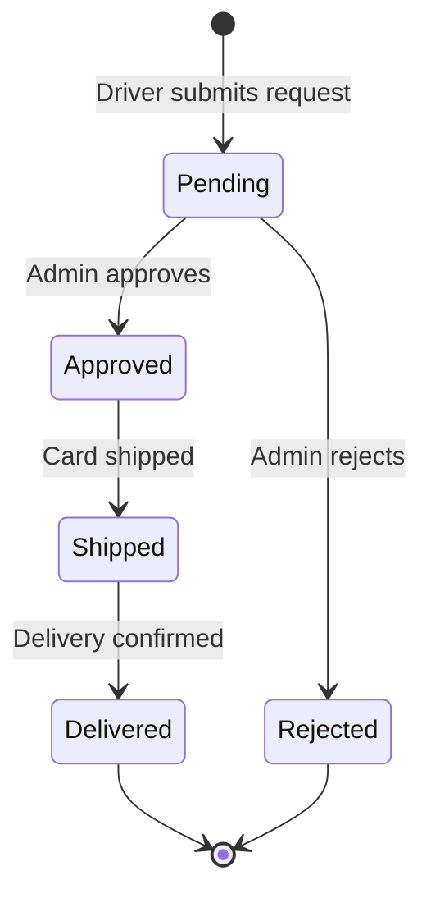
```mermaid
stateDiagram-v2
    [*] --> Pending: Driver submits request
    Pending --> Approved: Admin approves
    Pending --> Rejected: Admin rejects
    Approved --> Shipped: Card shipped
    Shipped --> Delivered: Delivery confirmed
    Delivered --> [*]
    Rejected --> [*]
```

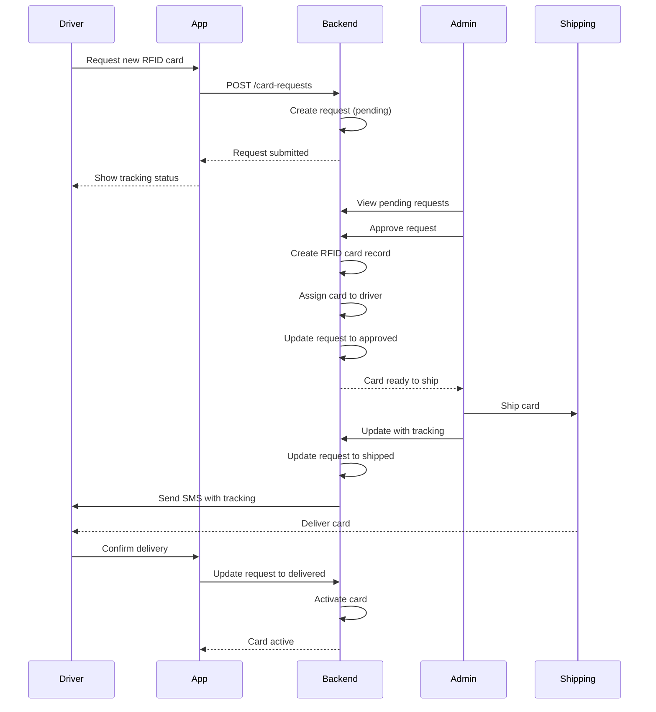
```mermaid
sequenceDiagram
    participant D as Driver
    participant A as App
    participant B as Backend
    participant Admin as Admin
    participant Ship as Shipping

    D->>A: Request new RFID card
    A->>B: POST /card-requests
    B->>B: Create request (pending)
    B-->>A: Request submitted
    A-->>D: Show tracking status

    Admin->>B: View pending requests
    Admin->>B: Approve request
    B->>B: Create RFID card record
    B->>B: Assign card to driver
    B->>B: Update request to approved
    B-->>Admin: Card ready to ship

    Admin->>Ship: Ship card
    Admin->>B: Update with tracking
    B->>B: Update request to shipped
    B->>D: Send SMS with tracking

    Ship-->>D: Deliver card
    D->>A: Confirm delivery
    A->>B: Update request to delivered
    B->>B: Activate card
    B-->>A: Card active
```

---

## 10. Dispute Resolution Workflow

### 10.1 Flow Diagram

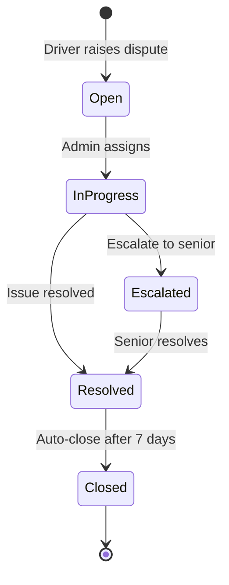
```mermaid
stateDiagram-v2
    [*] --> Open: Driver raises dispute
    Open --> InProgress: Admin assigns
    InProgress --> Resolved: Issue resolved
    InProgress --> Escalated: Escalate to senior
    Escalated --> Resolved: Senior resolves
    Resolved --> Closed: Auto-close after 7 days
    Closed --> [*]
```

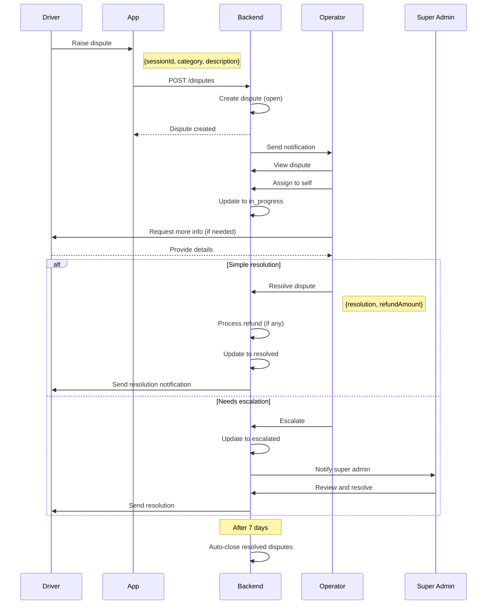
```mermaid
sequenceDiagram
    participant D as Driver
    participant A as App
    participant B as Backend
    participant Op as Operator
    participant SA as Super Admin

    D->>A: Raise dispute
    Note right of A: {sessionId, category, description}
    A->>B: POST /disputes
    B->>B: Create dispute (open)
    B-->>A: Dispute created
    B->>Op: Send notification

    Op->>B: View dispute
    Op->>B: Assign to self
    B->>B: Update to in_progress

    Op->>D: Request more info (if needed)
    D-->>Op: Provide details

    alt Simple resolution
        Op->>B: Resolve dispute
        Note right of Op: {resolution, refundAmount}
        B->>B: Process refund (if any)
        B->>B: Update to resolved
        B->>D: Send resolution notification
    else Needs escalation
        Op->>B: Escalate
        B->>B: Update to escalated
        B->>SA: Notify super admin
        SA->>B: Review and resolve
        B->>D: Send resolution
    end

    Note over B: After 7 days
    B->>B: Auto-close resolved disputes
```

---

## 11. Reservation Workflow

### 11.1 Flow Diagram

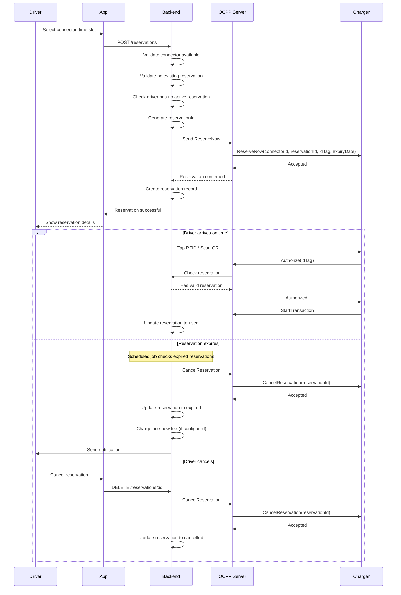
```mermaid
sequenceDiagram
    participant D as Driver
    participant A as App
    participant B as Backend
    participant O as OCPP Server
    participant C as Charger

    D->>A: Select connector, time slot
    A->>B: POST /reservations
    B->>B: Validate connector available
    B->>B: Validate no existing reservation
    B->>B: Check driver has no active reservation

    B->>B: Generate reservationId
    B->>O: Send ReserveNow
    O->>C: ReserveNow(connectorId, reservationId, idTag, expiryDate)
    C-->>O: Accepted
    O-->>B: Reservation confirmed

    B->>B: Create reservation record
    B-->>A: Reservation successful
    A-->>D: Show reservation details

    alt Driver arrives on time
        D->>C: Tap RFID / Scan QR
        C->>O: Authorize(idTag)
        O->>B: Check reservation
        B-->>O: Has valid reservation
        O-->>C: Authorized
        C->>O: StartTransaction
        B->>B: Update reservation to used
    else Reservation expires
        Note over B: Scheduled job checks expired reservations
        B->>O: CancelReservation
        O->>C: CancelReservation(reservationId)
        C-->>O: Accepted
        B->>B: Update reservation to expired
        B->>B: Charge no-show fee (if configured)
        B->>D: Send notification
    else Driver cancels
        D->>A: Cancel reservation
        A->>B: DELETE /reservations/:id
        B->>O: CancelReservation
        O->>C: CancelReservation(reservationId)
        C-->>O: Accepted
        B->>B: Update reservation to cancelled
    end
```

---

## 12. Report Generation Workflow

### 12.1 Flow Diagram

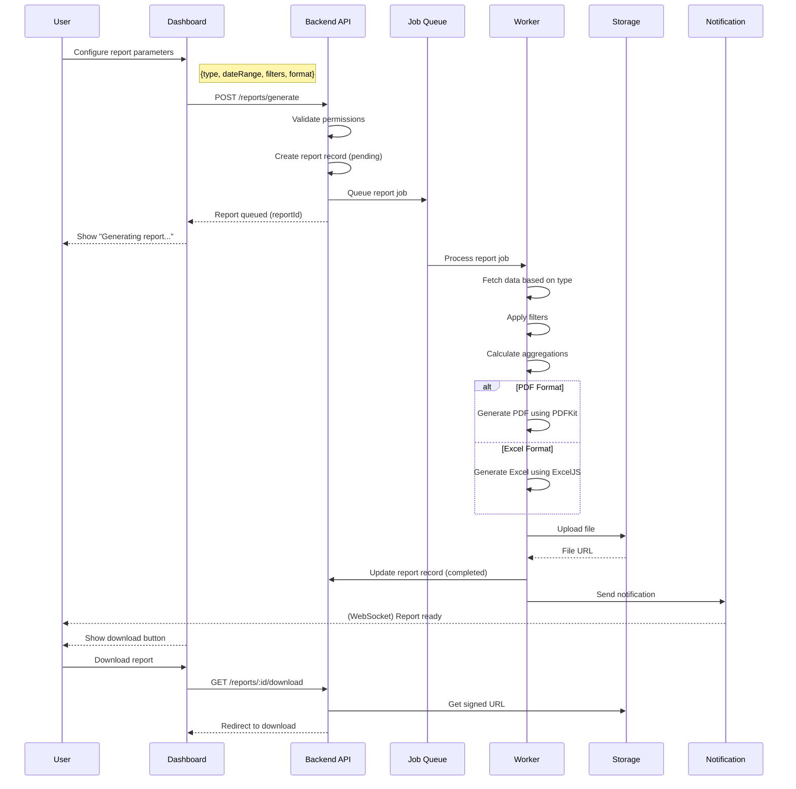
```mermaid
sequenceDiagram
    participant U as User
    participant D as Dashboard
    participant B as Backend API
    participant Q as Job Queue
    participant W as Worker
    participant S as Storage
    participant N as Notification

    U->>D: Configure report parameters
    Note right of D: {type, dateRange, filters, format}
    D->>B: POST /reports/generate

    B->>B: Validate permissions
    B->>B: Create report record (pending)
    B->>Q: Queue report job
    B-->>D: Report queued (reportId)
    D-->>U: Show "Generating report..."

    Q->>W: Process report job
    W->>W: Fetch data based on type
    W->>W: Apply filters
    W->>W: Calculate aggregations

    alt PDF Format
        W->>W: Generate PDF using PDFKit
    else Excel Format
        W->>W: Generate Excel using ExcelJS
    end

    W->>S: Upload file
    S-->>W: File URL
    W->>B: Update report record (completed)
    W->>N: Send notification

    N-->>U: (WebSocket) Report ready
    D-->>U: Show download button

    U->>D: Download report
    D->>B: GET /reports/:id/download
    B->>S: Get signed URL
    B-->>D: Redirect to download
```

### 12.2 Report Types

| Report | Data Included |
|--------|---------------|
| Session Report | Sessions, energy, duration, costs |
| Revenue Report | Daily/weekly/monthly revenue breakdown |
| Utilization Report | Station uptime, connector usage % |
| Driver Report | Driver activity, spending patterns |
| Settlement Report | Partner settlements, commissions |
| OCPP Report | Connection stats, message counts |

---

*End of Workflow Documentation*
